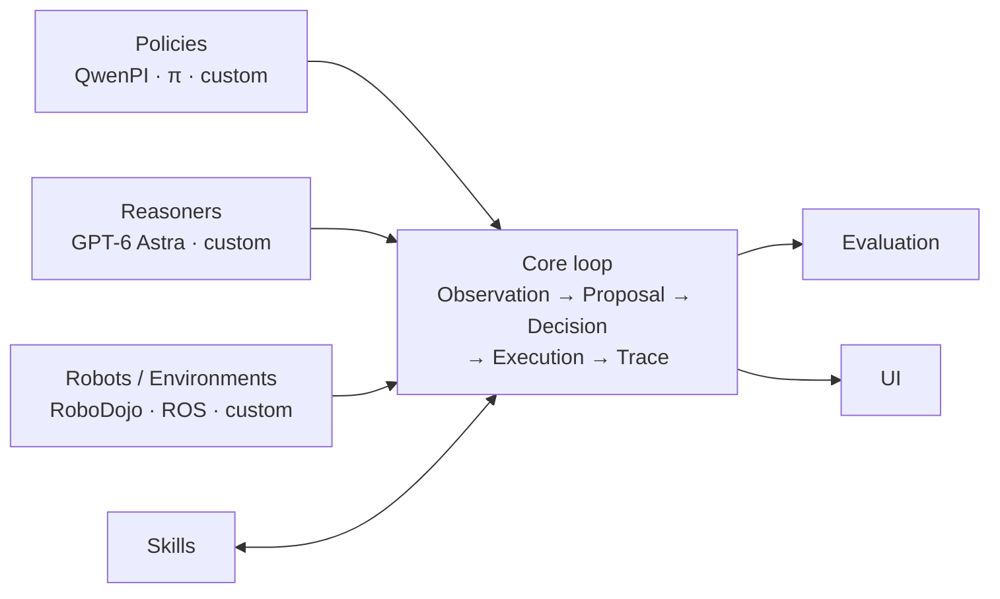

# StarRoboHarness

## An Open Execution Harness for Reasoning-Driven Robotics.

Connect multimodal models, robot policies, skills, and environments through one
observable, auditable, and reproducible control loop.

> StarRoboHarness is infrastructure, not another robot model. It does not
> train, replace, or unify policies; it gives different components a small,
> explicit contract for working together.

## What it does

StarRoboHarness turns a robot run into a readable chain of contracts:

```text
Observation → Proposal → Decision → Guarded Execution → Trace → Evaluation
```

- **Policies** propose actions or trajectories.
- **Reasoners** review, refine, or directly choose actions and skills.
- **Skills** expose reusable, bounded robot capabilities.
- **Robots and environments** return real observations, acknowledgements, and
  native outcomes.
- **Trace and evaluation** preserve what happened, why it happened, and how to
  reproduce the comparison.

The same loop supports a learned VLA, a classical controller, a multimodal
agent, or a hybrid of them. QwenPI_v3, GPT-6 Astra, and RoboDojo are reference
integrations—not the definition of the project.

## Architecture

```text
 Policies                 Reasoners                 Robots / Environments
 QwenPI · π · custom      GPT-6 Astra · custom     RoboDojo · ROS · custom
       \                       |                       /
        \                      |                      /
         +--------------------------------------------+
         |                 StarRoboHarness            |
         | Observation → Proposal → Decision          |
         |              → Execution → Trace           |
         +--------------------------------------------+
                    |                         |
                  Skills                 Evaluation / UI
```



The core package stays model-, provider-, simulator-, and middleware-neutral.
Heavy integrations are optional and remain behind adapter boundaries.

## Why a harness?

Robot experiments become difficult to compare when inference, reasoning,
execution, simulator services, and scoring are hidden inside one runner.
StarRoboHarness keeps those responsibilities separate while maintaining one
authoritative execution path. That makes a new policy easier to plug in, a
failure easier to attribute, and a result easier to audit or replay.

## The control loop

```text
Robot / environment
        ↓
Observation ──→ Policy ──→ Proposal ──→ Reasoner ──→ Decision
        ↑                                             ↓
        └──── actual ACK / outcome ← Guard / Execution

All nodes append evidence to Trace; Evaluation reads the same Trace.
```

The five stable boundaries are:

1. **Observation** — the exact post-action state visible to the next decision.
2. **Proposal** — a candidate action bound to one observation identity.
3. **Decision** — accept, reject, edit, or take over with explicit authority.
4. **Execution** — the guarded action actually sent to the robot/environment.
5. **Trace** — append-only, SHA-chained evidence with outcome, latency, and
   cost references.

## Modes

The same contracts support three useful operating modes:

1. **Policy-led** — a policy proposes and a reasoner supervises.
2. **Reasoner-led** — a multimodal reasoner directly selects actions or skills.
3. **Hybrid** — an explicit arbiter shares control and records every handoff.

This makes direct GPT-6 Astra control a normal execution mode rather than a
special benchmark path.

## Repository map

The tree is intentionally boring: each top-level directory has one job.

```text
src/starroboharness/       small public contracts and runtime
src/hybrid_rollout/        optional RoboDojo protocol integration
configs/                   versioned method, panel, and runtime manifests
examples/                  minimal local examples (when present)
scripts/                   launch, freeze, report, and smoke commands
skills/                    reusable online behavior contracts
docs/                      architecture, evaluation, research, and operations
tools/dashboard/                        read-only dashboard and local development launcher
tests/                     contract, adapter, rollout, and dashboard tests
```

The core dependency rule is strict: it must not import QwenPI, StarVLA, OpenPI,
RoboDojo, ROS, Isaac Sim, or a provider SDK. Integrations belong in adapters,
`src/hybrid_rollout`, or optional external processes.

## Quick start

```bash
python -m pip install -e '.[dev]'
pytest -q
python scripts/smoke_contracts.py
python examples/minimal_loop.py
```

Minimal policy integration:

```python
from starroboharness.adapters.qwenpi_v3 import QwenPIv3Adapter
from starroboharness.contracts import Observation

policy = QwenPIv3Adapter(infer=my_policy_infer, server_metadata=my_metadata)
proposal = policy.propose(
    Observation(
        observation_id="episode-1:0",
        instruction="build a tower",
        images={"cam_high": head_rgb},
        proprio=joint_state,
        step_id=0,
        remaining_steps=500,
    )
)
```

The QwenPI adapter demonstrates the boundary; it is not a dependency of the
core runtime. See [the architecture guide](docs/architecture.md),
[the evaluation protocol](docs/evaluation.md), and
[the project vision](StarRoboHarness.md).

## Evaluation and auditability

StarRoboHarness can compare a baseline policy, a reasoner-assisted policy, and
a reasoner-led agent without changing the observation, execution, or scoring
contracts. Results distinguish native success/score from infrastructure
failure, budget censoring, and interrupted control, and can include:

- method and runtime identity;
- action/reasoner latency and intervention count;
- token, cache, and cost summaries;
- actual execution acknowledgements and native termination;
- SHA-chained JSONL traces, manifest digests, and artifact references.

Large media, credentials, checkpoints, raw provider streams, and private COT
must stay in an access-controlled artifact store.

## Integrations

| Integration | Status | Boundary |
| --- | --- | --- |
| QwenPI_v3 / StarVLA policy adapter | available | `starroboharness.adapters` |
| GPT-6 Astra / Codex reasoner | experimental | `starroboharness.reasoners` |
| RoboDojo runtime | experimental | `src/hybrid_rollout` |
| π-family policies, ROS, custom robots | planned | adapter contracts |

## Documentation

- [Project vision](StarRoboHarness.md)
- [Architecture](docs/architecture.md)
- [Evaluation protocol](docs/evaluation.md)
- [Live evaluation](docs/live-evaluation.md)
- [Codex/reasoner evaluation](docs/codex-evaluation.md)
- [Efficiency research](docs/research_efficiency.md)
- [Collaborator guide](docs/iterations/README.md)
- [Dashboard guide](tools/dashboard/README.md)
- [Private-audit boundary](docs/audits/README.md)
- [Contributing](CONTRIBUTING.md)

## News

- ✨ **2026-09-19 — StarRoboHarness public refresh.** Rebranded the runtime,
  simplified the public tree, and clarified the execution/evaluation boundary.
- 🧭 **2026-09-18 — Public alpha refresh.** Added publication-safe comparison
  summaries and moved operational evidence to the private artifact boundary.

## Roadmap

- Stabilize policy, reasoner, skill, and robot adapter APIs.
- Add replayable local examples that require no simulator credentials.
- Expand evaluation backends while keeping one trace and validity contract.
- Improve scheduling, latency-aware reasoning, and operator dashboards.

## License

MIT. See [LICENSE](LICENSE) and [THIRD_PARTY_NOTICES.md](THIRD_PARTY_NOTICES.md).
