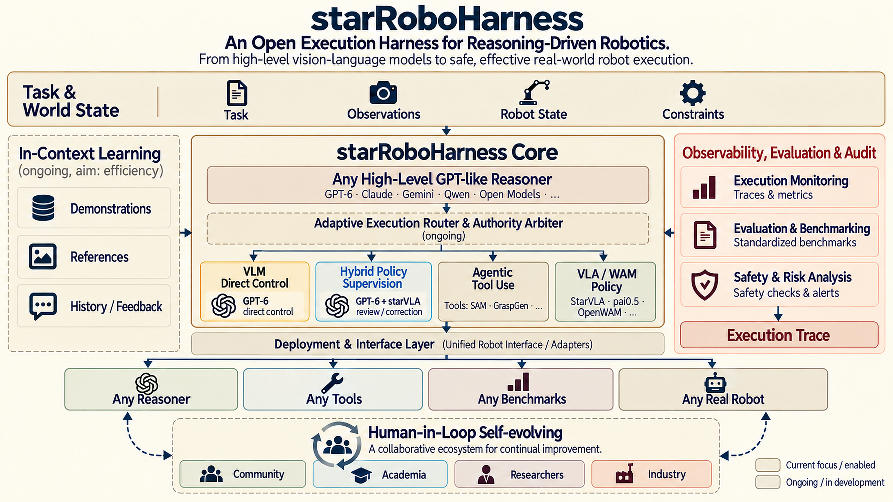

<p align="center">
  
</p>

<h1 align="center">StarRoboHarness</h1>

<p align="center">An open execution harness for reasoning-driven robotics.</p>

<p align="center">Connect policies, multimodal reasoners, skills, robots, and benchmarks through one safe, observable, auditable loop.</p>



## What it provides

StarRoboHarness keeps the control path explicit:

```text
Observation → Policy proposal → Reasoner decision → Guarded execution → Trace → Evaluation
```

- Stable contracts for policies, reasoners, environments, skills, and traces.
- Policy-led, reasoner-led, and hybrid execution modes.
- Safety gates that bind every decision to a fresh observation and proposal.
- Append-only, SHA-chained traces with native outcomes separated from infrastructure failures.
- Optional adapters for QwenPI_v3, RoboDojo, Codex-compatible reasoners, and custom robots.

The core package is model-, provider-, simulator-, and middleware-neutral. Large checkpoints, credentials, raw provider streams, and private reasoning traces stay outside the repository.

## Quick start

```bash
git clone https://github.com/starVLA/starRoboHarness.git
cd starRoboHarness
./scripts/bootstrap.sh
```

The bootstrap script creates `.venv`, installs the package and development dependencies, runs the contract smoke test, and executes the dependency-light example. It does not require API keys, a simulator, or a GPU.

For a local editable install only:

```bash
python -m pip install -e '.[dev]'
pytest -q
```

## First integration

```python
from starroboharness.adapters.qwenpi_v3 import QwenPIv3Adapter
from starroboharness.contracts import Observation

policy = QwenPIv3Adapter(infer=my_policy_infer, server_metadata=my_metadata)
proposal = policy.propose(
    Observation(
        observation_id="episode-1:0",
        instruction="build a tower",
        images={"cam_high": head_rgb},
        proprio=joint_state,
        step_id=0,
        remaining_steps=500,
    )
)
```

See [the architecture guide](docs/architecture.md) for the complete contract and [the evaluation protocol](docs/evaluation.md) for reproducible campaigns.

## Repository map

```text
src/starroboharness/   public contracts, gates, adapters, rollout, and traces
src/hybrid_rollout/    optional RoboDojo protocol integration
configs/               example method and evaluation manifests
scripts/               bootstrap, launch, freeze, report, and smoke commands
tools/dashboard/       read-only local execution dashboard
docs/                  architecture, operations, and evaluation guides
tests/                 contract and rollout tests
```

## Optional RoboDojo / cluster runs

The RoboDojo integration is intentionally optional. Install the extra and provide your own simulator, policy checkpoint, Codex login or provider, and local paths in a copied config:

```bash
python -m pip install -e '.[rollout]'
python scripts/launch_campaign.py --check-only \
  --config configs/runtime/local_robodojo_starvla.json \
  --panel configs/evaluation/robodojo_four_tasks_v1.json \
  --output ./artifacts/run \
  --supervisor ./artifacts/run-supervisor \
  --tmux-session starroboharness-check
```

Never commit credentials, private workspace paths, checkpoints, raw videos, or provider transcripts. Keep those in an access-controlled artifact store and publish only sanitized summaries and hashes.

## Documentation

- [Architecture](docs/architecture.md)
- [Evaluation protocol](docs/evaluation.md)
- [Live evaluation and monitoring](docs/live-evaluation.md)
- [Codex/reasoner integration](docs/codex-evaluation.md)
- [Dashboard](tools/dashboard/README.md)
- [Contributing](CONTRIBUTING.md)

## License

MIT. See [LICENSE](LICENSE) and [THIRD_PARTY_NOTICES.md](THIRD_PARTY_NOTICES.md).
