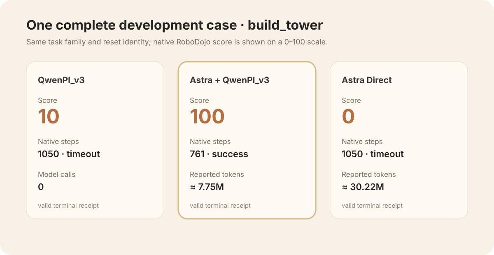

# v0.1.0-alpha.2 · publication-safe development evidence

Date: 2026-09-18  
Status: collaborative alpha; three complete off-panel development receipts

## What changed

This iteration turns the first integrated result into a contributor-friendly
public record. It keeps the method identity, native terminal validity, score,
steps, and rounded usage budget visible while moving raw operational evidence
to the private evidence bundle.

The three rows below use the same RoboDojo `build_tower` development case. They
are not a formal success-rate estimate and are not the frozen four- or
five-task panel.

## Three complete cases

| Method | Native terminal | Score | Controls | Policy calls | GPT correction steps | Wall time |
| --- | --- | ---: | ---: | ---: | ---: | ---: |
| QwenPI_v3, 16-step baseline | timeout | 10/100 | 1050 | 66 | 0 | 14.5 min |
| Astra + QwenPI_v3 | **success** | **100/100** | 761 | 52 | 0 | 25.4 min |
| Astra Direct | timeout | 0/100 | 1050 | 210 | 1050 | 132.2 min |

All three rows have complete native terminal receipts. The hybrid success is a
real combined-method success, but it is not by itself a causal proof that GPT
correction produced the gain: the episode recorded zero correction steps and
used a different dynamic student-prefix cadence from the 16-step baseline.

## Usage budget

The following are rounded asynchronous runtime snapshots, not hidden
chain-of-thought and not final provider billing:

| Method | Input | Cached input | Output | Planning estimate* |
| --- | ---: | ---: | ---: | ---: |
| QwenPI_v3 baseline | — | — | — | $0 model budget |
| Astra + QwenPI_v3 | 7.72M | 7.41M | 13.9k | ≈$11.25 |
| Astra Direct | 30.18M | 29.90M | 43.6k | ≈$34.81 |
| **Total** | **37.90M** | **37.31M** | **57.5k** | **≈$46.06** |

\*Planning estimate uses the dashboard's illustrative rates of `$10/M`
uncached input, `$1/M` cached input, and `$50/M` output. It must not be read as
an account invoice. Cache ratios and provider pricing can change.

## Reproducibility boundary

The public record preserves task identity at the semantic level, method labels,
validity semantics, and result accounting. It intentionally omits account
identifiers, cluster/pod names, internal IPs, absolute paths, process IDs,
checkpoint locations, raw RPC streams, and raw usage receipts.

The private evidence bundle contains the full JSON/native receipts, camera
frames and MP4 previews, public decision records, RPC events, usage snapshots,
and infrastructure-failure attempts. A release consumer can request that
bundle separately without turning operational metadata into public API.

## What this does and does not establish

- It establishes that the UnityPolicy proposal/review/execution path can
  produce a valid hybrid RoboDojo terminal result.
- It does not establish a formal success rate from one case per method.
- It does not isolate GPT reasoning from cadence, rendering variation, shared
  GPU latency, or policy stochasticity.
- It does not publish hidden model chain-of-thought; only explicitly recorded
  public decision/tool evidence is retained privately.

## Next iteration

The next release should use a pre-registered multi-case panel, report paired
coverage before aggregate scores, separate infrastructure failures from model
failures, and publish confidence intervals once the sample size supports them.
